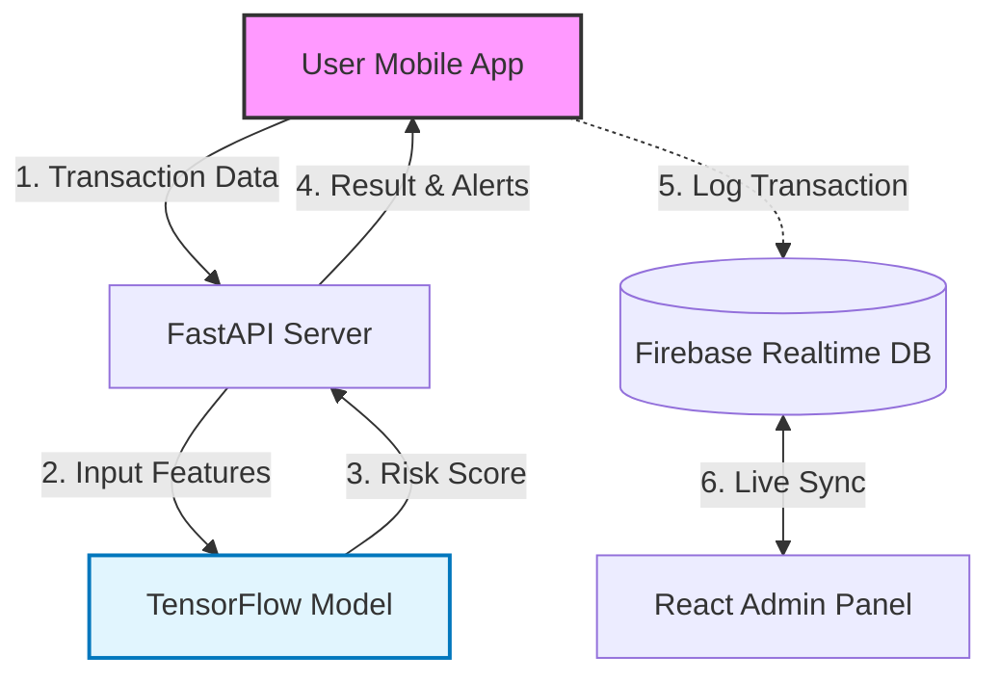

# 🛡️ Fraud Lens - UPI Fraud Detection System


---

## 🚀 Quick Links

### Live Demos
*   **Admin Panel:** https://fraudlens-admin-panel.vercel.app
*   **ML Model Demo:** https://fraudlens-streamlit.onrender.com

### Source Code Repositories
*   **[Web Admin Panel & AI Agent](https://github.com/shaikharshan/FraudLens-Web-Admin-Panel)**: React.js dashboard and AI agent integration.
*   **[ML Model & Streamlit Demo](https://github.com/shaikharshan/Fraudlens-Streamlit-Model-Demo)**: TensorFlow model and interactive Streamlit demo.
*   **[Real-time Vishing Detector](https://github.com/shaikharshan/Fraudlens-Realtime-Vishing-Detector)**: FastAPI backend for real-time voice scam detection.

---

**Fraud Lens** is a comprehensive, multi-modal fraud detection platform designed to secure UPI transactions. It bridges the gap between user-side prevention and bank-side monitoring through real-time risk analysis.

The system operates on two fronts:
1.  **Pre-Transaction:** A mobile application that analyzes risk in real-time *before* a payment is made.
2.  **Post-Transaction:** An admin dashboard for banks/auditors to monitor transaction flows and investigate flagged activities.

---

## ✨ Features

### 📱 Mobile App (User Client)
* **Built with:** Kotlin & Jetpack Compose
* **Pre-Transaction Analysis:** Scans transaction context (receiver details, amount patterns) to calculate a risk score before the user enters their UPI PIN.
* **Real-time Alerts:** Warnings displayed immediately if the ML model detects high-risk parameters.
* **Secure Interface:** Modern, declarative UI/UX designed for seamless payments.

### 💻 Admin Panel (Bank Dashboard)
* **Built with:** React.js
* **Live Monitoring:** Real-time feed of transactions occurring across the network.
* **Visual Analytics:** Charts and graphs visualizing fraud trends and high-risk zones.
* **Flag Management:** Interface for administrators to review and resolve flagged transactions stored in Firebase.

### 🧠 The Core (AI & Backend)
* **Machine Learning:** TensorFlow model trained on transaction datasets to detect anomalies.
* **API Layer:** FastAPI serves the model predictions to the mobile client with low latency.
* **Database:** Firebase for real-time data syncing between the app and the admin panel.

### 🤖 AI Agent (Smishing & Vishing Detection)
* **Built with:** FastAPI, LangChain, Google Gemini
* **Real-time Smishing Analysis:** Analyzes incoming SMS messages for phishing links and malicious intent.
* **Live Vishing Intervention:** Listens to voice calls in real-time (via WebSocket) to detect scam patterns and provides immediate alerts to the user.

---

## 🛠️ Tech Stack

| Component | Technology |
| :--- | :--- |
| **Mobile App** | Kotlin, Jetpack Compose |
| **Web Dashboard** | React.js, JavaScript |
| **Backend API** | Python, FastAPI |
| **ML/AI** | TensorFlow, Keras, LangChain, Google Gemini |
| **Database/Auth** | Google Firebase |

---

## 🔐 Secure local setup (after clone)

For runnable app setup and secret injection, use these project READMEs:

- Native Android app: `FraudLens/README.md`
- React Native module usage: `react-native-fraudlens/README.md`
- Flutter plugin + example app: `fraudlens_flutter/README.md`

Do not commit real API keys or `google-services.json`.

---

## 🏗️ System Architecture

### 1. Core Transaction Fraud Detection
This flow handles the real-time analysis of UPI transactions using the TensorFlow model.


```mermaid
graph TD
    %% Components
    User[User Mobile App]
    API[FastAPI Server]
    LC[LangChain Orchestrator]
    Gemini[Google Gemini 1.5 Flash]

    %% Path 1: Smishing (SMS)
    User -- HTTP POST: SMS Text --> API
    API -->|Raw Text| LC
    LC -->|Prompt: SMS Analysis| Gemini
    Gemini -->|Verdict: Phishing/Safe| LC
    LC -->|Alert Notification| User

    %% Path 2: Vishing (Voice)
    User == WebSocket: Audio Stream ==> API
    API <==>|Bi-directional Stream| LC
    LC -->|System Prompt: Voice Security| Gemini
    Gemini -->|Real-time Intervention| LC
    LC -->|Interrupt/Alert Signal| API
    API == WebSocket: URGENT WARNING ==> User

    %% Styling
    style User fill:#f9f,stroke:#333,stroke-width:2px
    style Gemini fill:#fff3e0,stroke:#ff9800,stroke-width:2px
